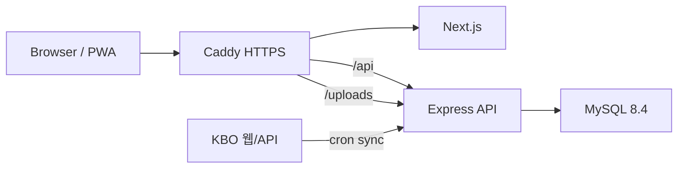

# 야크크 야르~ 섹시야구

## 한 줄 요약

KBO 팬이 **직관/집관 기록**을 캘린더에 남기고, 사진·메모·동행자·공식 경기 결과를 함께 관리하는 **모바일 친화형 PWA** 웹앱.

## 프로젝트 성격

- **학습/과제 프로젝트**이면서 **운영 실습**까지 포함한 MVP+
- 로그인, CRUD, 게시판, 댓글, 페이징, DB 관계, Swagger, Docker, 배포 흐름을 모두 경험
- KBO 일정/결과/선발/라인업을 외부 데이터에서 동기화해 야구 팬 UX 제공

## 기술 스택

| 영역 | 스택 |
|------|------|
| Frontend | Next.js (App Router), TypeScript, 커스텀 CSS |
| Backend | Node.js, Express.js |
| Database | MySQL 8.4 |
| Auth | JWT, bcrypt, Gmail SMTP 이메일 인증, httpOnly Cookie |
| API Docs | Swagger / OpenAPI |
| Infra | Docker Compose, Google Cloud Compute Engine, Caddy |
| App | PWA (manifest, service worker, offline fallback) |

## 저장소 구조

```
yakuku-yaru/
  apps/
    web/              # Next.js 프론트엔드
    api/              # Express 백엔드
  docs/               # 프로젝트 내부 스펙 문서
  scripts/kbo-sync/   # 운영 KBO 동기화 cron 래퍼
  docker-compose.yml
  docker-compose.prod.yml
```

npm workspace 기반 **모노레포**.

## 시스템 구성



## 운영 URL

| 서비스 | URL |
|--------|-----|
| Web | https://yakuku-yaru.today |
| API health | https://yakuku-yaru.today/api/health |
| Swagger | https://yakuku-yaru.today/api-docs |

## 타깃 사용자

- KBO 경기를 자주 보는 팬
- 직관/집관 기록을 사진과 함께 모으고 싶은 팬
- 내 직관 승률·`승리요정` 타이틀을 확인하고 싶은 팬
- 동행자와 같은 경기 기록을 공유하고 싶은 팬

## Non-Goals (의도적으로 하지 않은 것)

- 결제·티켓 예매
- KBO 공식 실시간 중계 수준의 정확도 보장
- 브라우저 푸시 알림 (앱 내부 알림만)
- Native / Flutter 앱

## 관련 문서

- [[01 요구사항]]
- [[02 기능 목록]]
- [[03 DB 설계]]
- [[04 화면 구조]]
- [[05 배포 및 운영]]
- [[06 재사용 코드]]
- [[회고]]
