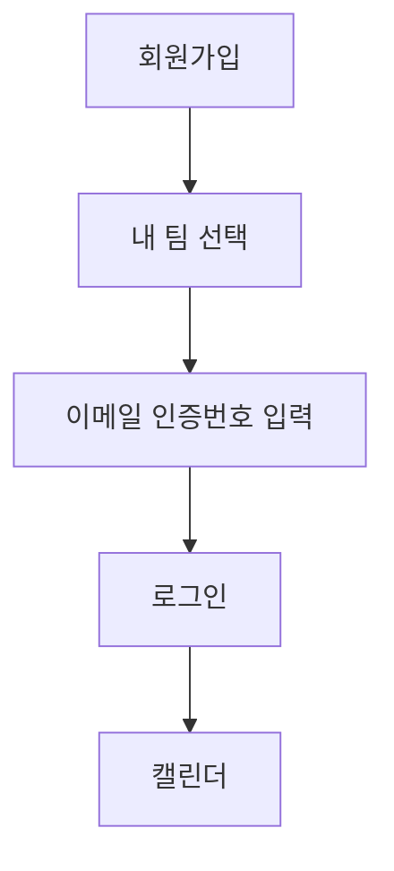
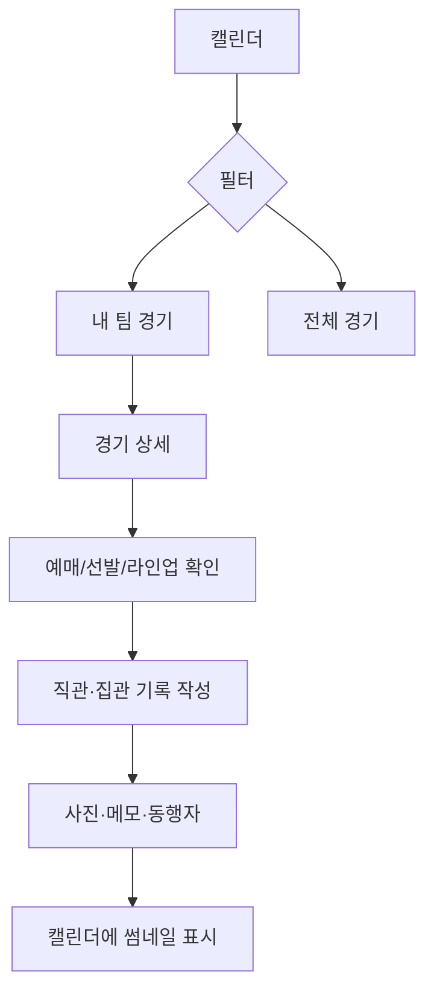
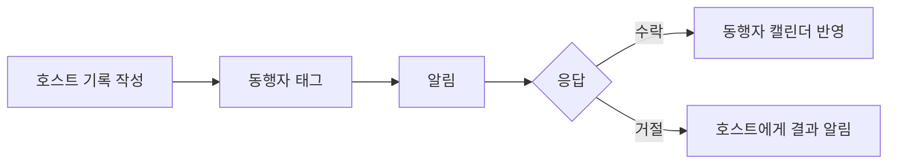
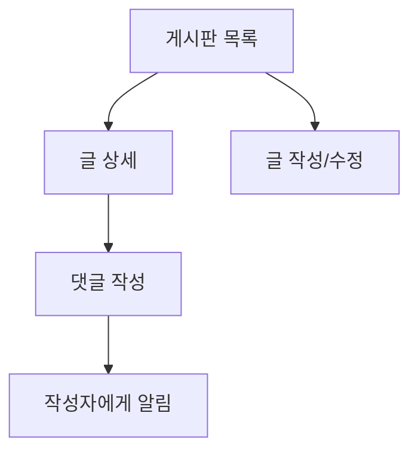

# 화면 구조

## 라우트 맵

| 경로 | 화면 | 인증 |
|------|------|------|
| `/` | 홈 — 다가오는 경기, 통계 요약, 순위 | optional |
| `/login` | 로그인 | public |
| `/register` | 회원가입 + 내 팀 선택 | public |
| `/verify-email` | 이메일 인증 | public |
| `/forgot-password` | 비밀번호 재설정 요청 | public |
| `/reset-password` | 비밀번호 재설정 | public |
| `/calendar` | 월간 캘린더 | required |
| `/games/[gameId]` | 경기 상세 | optional |
| `/attendance/new` | 직관/집관 기록 작성 | required |
| `/attendance/[recordId]/edit` | 기록 수정 | required |
| `/posts` | 게시판 목록 | public |
| `/posts/new` | 글 작성 | required |
| `/posts/[postId]` | 글 상세 + 댓글 | public |
| `/posts/[postId]/edit` | 글 수정 | required |
| `/cheers` | 선수 응원가 목록 | optional |
| `/me` | 마이페이지 | required |
| `/admin` | 관리자 | admin |
| `/offline` | PWA 오프라인 | public |

## 글로벌 네비게이션

- **GNB**: 홈, 캘린더, 게시판, 마이페이지, (관리자)
- **모바일 하단 탭**: 홈, 캘린더, 게시판, 마이페이지
- 로그인 시 닉네임·프로필 이미지 표시
- 선택 팀 컬러가 버튼·accent에 반영

## 사용자 흐름

### 1. 온보딩

### 2. 경기 확인 → 기록

### 3. 동행자 태그

### 4. 커뮤니티

## 화면별 구성 요소

### 홈 (`/`)

- 다가오는 내 팀 경기
- 직관 승률·기록 수 요약
- 팀 순위 테이블
- `승리요정` 등 타이틀 스와이퍼

### 캘린더 (`/calendar`)

- 월 네비게이션
- 필터: 내 팀/전체, 직관/집관, 기록 있는 날
- PC: sticky 필터 바 + 오늘 버튼
- 모바일: 하단 필터 dock + FAB
- 날짜별: 경기 카드 + 기록 썸네일/동행 배지

### 경기 상세 (`/games/[gameId]`)

- 매치업, 스코어, 취소 아이콘
- 예매 링크·오픈 시간
- 경기 알림 토글
- 선발 투수 카드 (ERA, WHIP, WAR, QS)
- 라인업 (타순, 포지션, 선수 사진)
- 구장 맛집/주차 + 개인 메모
- 직관 기록 작성/티켓형 기록 보기

### 직관 기록 폼

- 관람 유형: 직관 / 집관
- 응원 팀 (내 팀 경기 외)
- 사진 업로드 + 미리보기
- 메모
- 공식 스코어·결과 안내 (읽기 전용)
- 동행자 검색·선택·응답 상태

### 마이페이지 (`/me`)

- 프로필·내 팀 변경
- 전체/직관/집관 통계
- 승률, `승리요정`
- 알림 목록 (동행, 댓글)

### 게시판

- 컴팩트 리스트: 제목, 작성자, 댓글 수, 날짜
- 상세: 본문 + 댓글 + 입력창

### 관리자 (`/admin`)

- 사용자·게시글·댓글·경기·응원가 탭
- 운영 요약 카드

## 상태 관리 (프론트)

| 데이터 | 도구 |
|--------|------|
| 서버 데이터 (경기, 기록, 게시글…) | TanStack Query (`lib/queries.ts`) |
| 인증 세션 | Zustand + `/auth/me` |
| 캘린더 필터/보기 | Zustand |
| 폼·미리보기 | React state + RHF/Zod |

## 모바일 UX 원칙

- 터치 영역 최소 44px
- 하단 네비로 주요 탭 접근
- 카메라/앨범 사진 선택
- 알림 팝업 뷰포트 내 배치

## 관련 문서

- [[Project/야크크 야르 섹시야구/02 기능 목록]]
- [[직관 집관 기록]]
- [[동행자 태그]]
