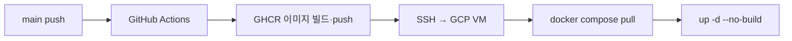

# 배포 및 운영

## 프로덕션 구성

```txt
Google Cloud Compute Engine (e2-small 등)
  ├─ caddy     HTTPS reverse proxy, Let's Encrypt
  ├─ web       Next.js (GHCR 이미지)
  ├─ api       Express + /uploads 정적 서빙
  └─ mysql     MySQL 8.4
```

| URL | 용도 |
|-----|------|
| https://yakuku-yaru.today | Web |
| https://yakuku-yaru.today/api/health | API 헬스체크 |
| https://yakuku-yaru.today/api-docs | Swagger |

## 배포 파이프라인



→ [[Decisions/GHCR 빌드 분리 배포]]

### GitHub Secrets

| Secret | 설명 |
|--------|------|
| `DEPLOY_HOST` | VM 외부 IP |
| `DEPLOY_USER` | SSH 사용자 |
| `DEPLOY_SSH_KEY` | private key 전체 |
| `DEPLOY_PATH` | repo 경로 |
| `DEPLOY_COMPOSE_PROFILES` | `proxy` (Caddy) |
| `NEXT_PUBLIC_API_URL` | 빌드 시 web에 주입 |

## 환경 변수 (운영 필수)

```env
APP_URL=https://yakuku-yaru.today
APP_DOMAIN=yakuku-yaru.today
NEXT_PUBLIC_API_URL=https://yakuku-yaru.today/api
JWT_SECRET=<long-random>
SMTP_HOST=smtp.gmail.com
SMTP_USER=<gmail>
SMTP_PASSWORD=<app-password>
```

## 데이터 보존 (Docker Volume)

| Volume | 내용 |
|--------|------|
| `mysql_data` | DB |
| `api_uploads` | 업로드 이미지 |
| `caddy_data`, `caddy_config` | TLS 인증서 |

⚠️ `docker compose down -v` 는 **DB·업로드 삭제**

NAS 마운트 시: `UPLOADS_HOST_DIR=/mnt/yakuku-uploads`

## KBO 동기화 운영

서버 **호스트 crontab** + `scripts/kbo-sync/` (API 내장 cron 기본 OFF)

| 스크립트 | 주기 (KST) | 내용 |
|----------|------------|------|
| `week.sh` | 매일 06:00 | 일정 week |
| `game-center.sh` | 매일 06:10 | 선발/라인업 week |
| `standings.sh` | 매일 06:20 | 순위 |
| `today.sh` | 경기일 30분 간격 | 당일 스코어 |
| `weekly.sh` | 월 07:10 | 선수 마스터 |
| `month.sh` | 매월 1일 | 월간 일정 |
| `season.sh` | 매년 3/1 | 시즌 일정 |

- 동시 실행 방지: `flock` (`/tmp/yakuku-kbo-sync.lock`)
- 로그: `logs/kbo-sync/`

→ [[Features/KBO 데이터 동기화]]

## 도메인·HTTPS

1. DuckDNS 또는 구매 도메인 → VM IP
2. GCP 방화벽 80/443 개방
3. `APP_DOMAIN` 설정 후 `docker compose --profile proxy up`
4. Caddy가 Let's Encrypt 자동 발급
5. 3000/4000 외부 포트는 닫기 권장

## 수동 배포

```bash
cd ~/yakuku-yaru
git pull
docker compose --env-file .env.production -f docker-compose.prod.yml --profile proxy up -d --no-build
```

## 모니터링·점검

```bash
# 컨테이너 상태
docker compose --env-file .env.production -f docker-compose.prod.yml ps

# API 로그
docker compose ... logs -f api

# KBO sync 로그
tail -f logs/kbo-sync/*.log
```

## 알려진 운영 이슈

- 단일 VM → 배포 중 **짧은 다운타임**
- SMTP 미설정 시 이메일 인증 불가
- KBO HTML 변경 시 sync 실패 → 파서 수정 필요
- e2-small 메모리 제한 → 서버 빌드 금지, GHCR pull만

## 관련 이슈

- [[Issues/GitHub Actions SSH 인증 실패]]
- [[Issues/e2-small VM 빌드 부담]]
- [[Issues/KBO 파서 구조 변경 대응]]

## 다음 개선 (백로그)

- Managed MySQL / Object Storage
- Blue-green 배포
- 업로드 CDN
- 푸시 알림
