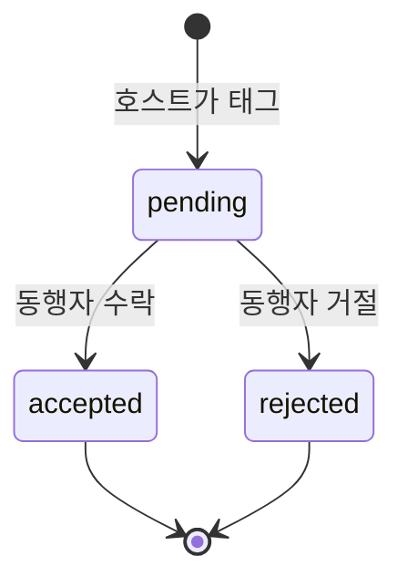

# 동행자 태그

## 개요

직관/집관 기록에 다른 **가입 회원**을 태그. 태그된 사람이 수락해야 상대 캘린더·승률에 반영.

## 상태 머신

## DB

`attendance_companions`

| 컬럼 | 설명 |
|------|------|
| attendance_record_id | 호스트 기록 |
| user_id | 태그된 회원 |
| status | pending / accepted / rejected |
| responded_at | 응답 시각 |

## 알림

| 이벤트 | type | 수신자 |
|--------|------|--------|
| 태그됨 | attendance_tagged | 동행자 |
| 수락 | companion_accepted | 호스트 |
| 거절 | companion_rejected | 호스트 |

## 승률·캘린더

- **수락**된 동행 기록 → 동행자의 기록 목록·통계에 포함
- 같은 경기에 호스트 기록과 동행 기록이 둘 다 있으면 **우선순위**로 dedupe (직관 > 집관, owner > companion)

## UI

- 기록 폼: `CompanionPicker` — 닉네임 검색
- 마이페이지: 알림에서 수락/거절
- 캘린더: `동행` 배지

## 관련

- [[03 DB 설계#5. attendance_companions 분리]]
- [[Features/직관 집관 기록]]
- [[04 화면 구조#3. 동행자 태그]]
